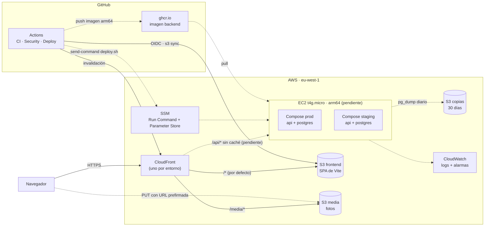

# Arquitectura y despliegue

> Las piezas marcadas como *(pendiente)* todavía no existen en AWS. Ver la lista de pendientes en [`CLAUDE.md`](../CLAUDE.md#aws-ya-creado).

## Vista general

## Peticiones

| Ruta | Destino | Caché |
|---|---|---|
| `/*` | Bucket del frontend. La función `es-b2-spa-rewrite` reescribe las rutas sin extensión a `/index.html`. | Sí |
| `/media/*` | Bucket de fotos | Sí |
| `/api/*` | EC2, al proyecto Compose del entorno, en su propio puerto *(pendiente)* | No |

El navegador solo ve un dominio por entorno. Por eso el frontend llama a `/api/...` con rutas relativas y no hace falta CORS fuera de local.

Las fotos no pasan por el backend. La API genera una URL prefirmada y el navegador hace `PUT` directamente a S3.

## Del commit a producción

1. **PR contra `develop`**: se ejecutan `CI` (lint, tests, cobertura y build de la imagen arm64) y `Security` (CodeQL, Trivy y Checkov). Hace falta que estén en verde y la revisión de otra persona.
2. **Merge a `develop`**: `Deploy staging` despliega sola en staging. Ahí se prueba la historia (Definition of Done).
3. **PR de `develop` a `main`** antes de cada demo, con los mismos checks.
4. **Merge a `main`**: `Deploy prod` espera la aprobación de DevOps (environment `production`) y despliega.

Los dos despliegues usan el mismo workflow reutilizable ([`_deploy.yml`](../.github/workflows/_deploy.yml)) con distintos parámetros. Así staging es un clon fiel de producción.

### Backend *(pendiente de la EC2)*

1. GitHub Actions construye la imagen para arm64 en `ubuntu-24.04-arm` y la sube a `ghcr.io/ub-es-2026-b2/project-backend:<sha>`.
2. `aws ssm send-command` ejecuta `infra/ec2/deploy.sh <entorno> <sha>` en la EC2. No hay SSH ni puerto 22.
3. `deploy.sh` arranca la versión nueva y llama a `/api/health` varias veces. Si falla, vuelve a la imagen guardada en `/opt/app/<entorno>/.last-good` y el workflow falla.

## Credenciales

- **GitHub → AWS:** OIDC con el rol `es-b2-github-deploy`. No hay claves de acceso guardadas en ningún sitio.
- **Aplicación:** los secretos (`SECRET_KEY`, contraseña de Postgres) se guardan en SSM Parameter Store como `SecureString`. La EC2 los lee al desplegar.

## Entornos

| | Local | Staging | Producción |
|---|---|---|---|
| Rama | cualquiera | `develop` | `main` |
| Despliegue | `docker compose up` | automático | automático con aprobación |
| Frontend | Vite (`localhost:5173`) | bucket + CloudFront de staging *(pendiente)* | `es-b2-frontend-891377256343` + `E2JFW10E80A64` |
| Backend + BD | contenedores locales | proyecto Compose `staging` en la EC2 | proyecto Compose `prod` en la EC2 |
